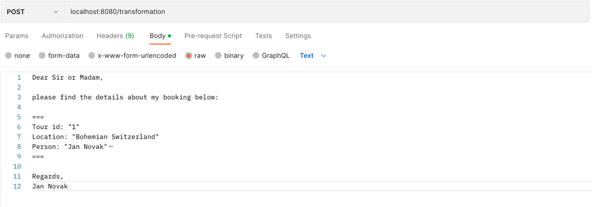
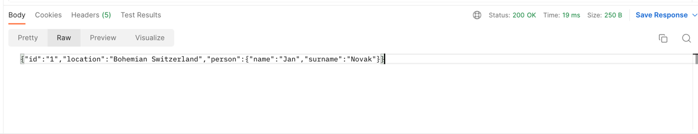

<h2>NI-AM1</h2>

<h3>Integration Issues - Transformation of formats</h3>

1. We need to send POST request with message in body to endpoint "transformation"

2. After sending a request, we have got pretty transformed JSON string

3. Success :)