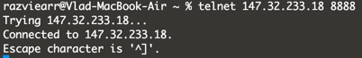
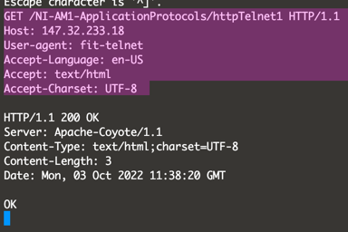
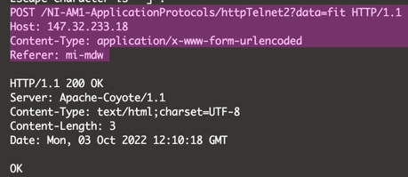

<h1>2. HTTP Application Protocol - telnet, openssl, cURL</h1>

<h3>Telnet</h3>
1. 

2.

3.

<h3>cURL</h3>

1.
<h4>Request:</h4>
razviearr@Vlad-MacBook-Air 02 % curl http://147.32.233.18:8888/NI-AM1-ApplicationProtocols/protocol/welcome

<h4>Response:</h4>
OK
Your next page is /protocol/get
send GET parameter "name" with value "agreed"
set Header "Accept" to "text/plain"

2.
<h4>Request:</h4>
razviearr@Vlad-MacBook-Air 02 % curl -i -H "Accept: text/plain" -X GET "http://147.32.23.18:8888/NI-AM1-ApplicationProtocols/protocol/get?name=agreed"
<h4>Response:</h4>
HTTP/1.1 200 OK
Server: Apache-Coyote/1.1
Content-Type: text/plain;charset=UTF-8
Content-Length: 172
Date: Mon, 03 Oct 2022 18:17:16 GMT

OK
Your next page is /protocol/post
send POST parameter "name" with value "mistaken"
and set Header "Accept" is "text/plain"
and set Header "Accept-Language" is "en-US"
3.
<h4>Request:</h4>
razviearr@Vlad-MacBook-Air 02 % curl -i -H "Accept: text/plain" -H "Accept-Language: en-US" -X POST "http://147.32.233.18:8888/NI-AM1-ApplicationProtocols/protocol/post?name=mistaken"
<h4>Response:</h4>
HTTP/1.1 200 OK
Server: Apache-Coyote/1.1
Content-Type: text/plain;charset=UTF-8
Content-Length: 111
Date: Mon, 03 Oct 2022 18:18:21 GMT

OK
Your next page is /protocol/referer
change referer to value "limiting"
set Header "Accept" is "text/html"

4.
<h4>Request:</h4>
razviearr@Vlad-MacBook-Air 02 % curl -i -H "Accept: text/html" --referer "limiting" "http://147.32.233.18:8888/NI-AM1-ApplicationProtocols/protocol/referer"
<h4>Response:</h4>
HTTP/1.1 200 OK
Server: Apache-Coyote/1.1
Content-Type: text/plain;charset=UTF-8
Content-Length: 127
Date: Mon, 03 Oct 2022 18:26:32 GMT

OK
Your next page is /protocol/useragent
and change User-Agent to value "pillage"
and set Header "Accept-Language" is "en-US"

5.
<h4>Request:</h4>
razviearr@Vlad-MacBook-Air 02 % curl -i -H "Accept-language: en-US" -H "User-Agent: pillage" "http://147.32.233.18:8888/NI-AM1-ApplicationProtocols/protocol/useragent"
<h4>Response:</h4>
HTTP/1.1 200 OK
Server: Apache-Coyote/1.1
Content-Type: text/plain;charset=UTF-8
Content-Length: 87
Date: Mon, 03 Oct 2022 18:28:00 GMT

OK
Your next page is /protocol/cookie
send cookie called "name" with value "twpierce"

6.
<h4>Request:</h4>
razviearr@Vlad-MacBook-Air 02 % curl -i --cookie "name=twpierce" "http://147.32.233.18:8888/NI-AM1-ApplicationProtocols/protocol/cookie"
<h4>Response:</h4>
HTTP/1.1 200 OK
Server: Apache-Coyote/1.1
Content-Type: text/plain;charset=UTF-8
Content-Length: 104
Date: Mon, 03 Oct 2022 18:32:18 GMT

OK
Your next page is /protocol/auth
authenticate by "tove:nations"
set Header "Accept" is "text/html"

7.
<h4>Request:</h4>
razviearr@Vlad-MacBook-Air 02 % curl -i -H "Accept: text/html" -u "tove:nations" "http://147.32.233.18:8888/NI-AM1-ApplicationProtocols/protocol/auth"
<h4>Response:</h4>
HTTP/1.1 200 OK
Server: Apache-Coyote/1.1
Content-Type: text/html;charset=UTF-8
Content-Length: 32
Date: Mon, 03 Oct 2022 18:37:47 GMT

OK
Your final result is: packet