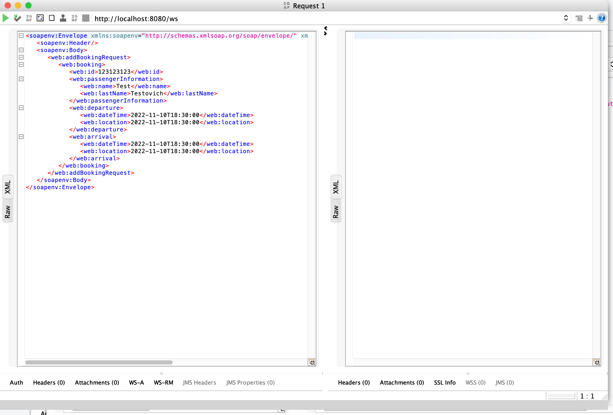
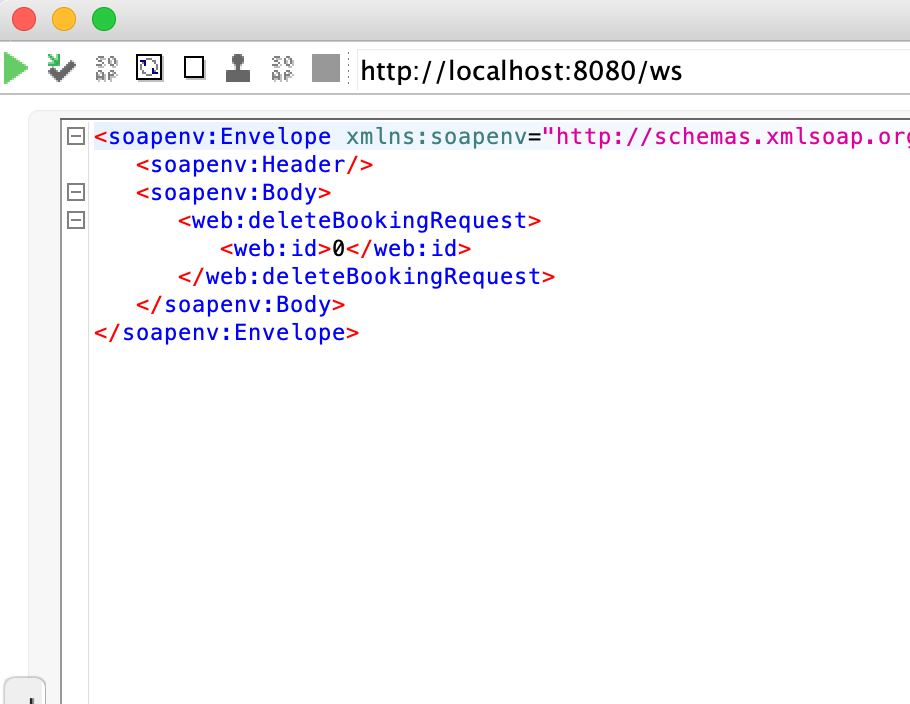
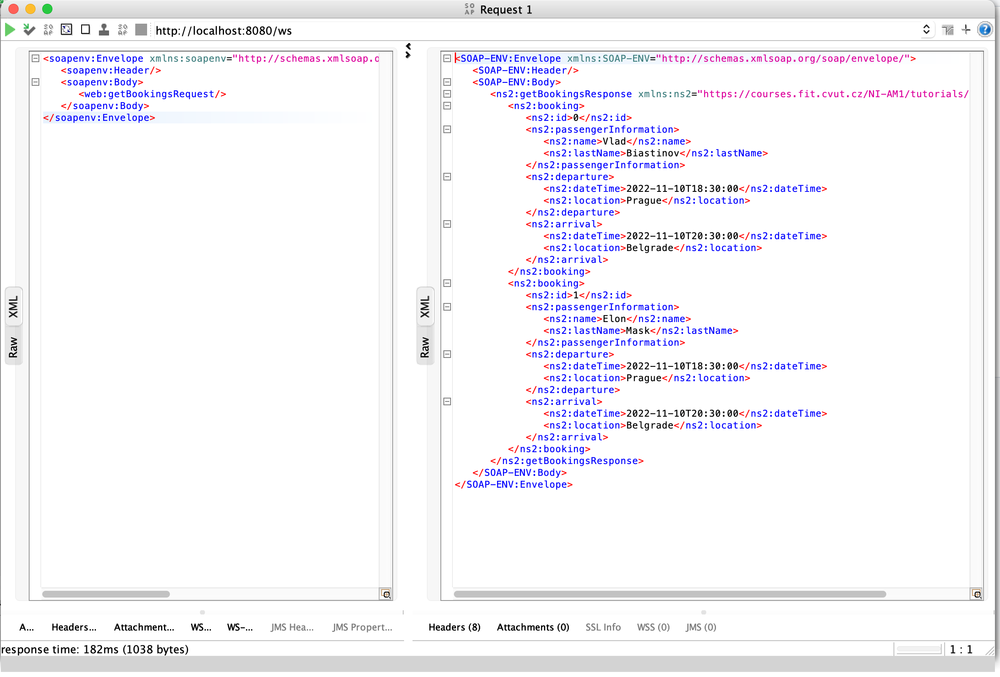
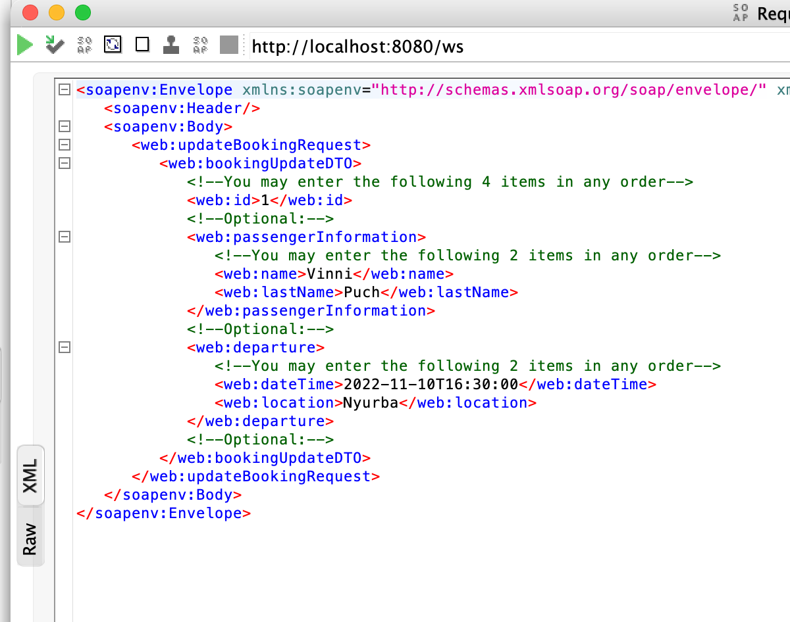
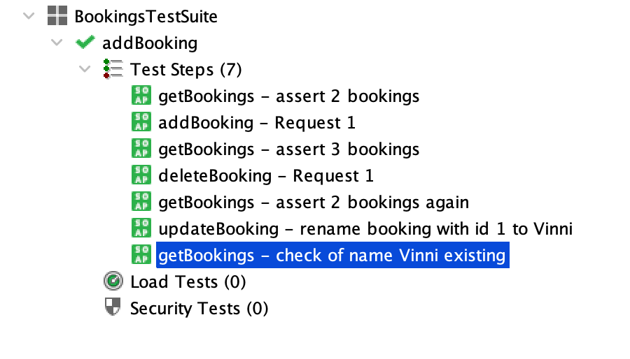

<h1>3. Web Services</h1>

<h2>Project has 4 requests to do classic CRUD operations:</h2>

<h3>Add Booking</h3>

<h3>Delete Booking by id</h3>

<h3>Get Bookings</h3>

<h3>Update Booking</h3>

<h2> I made 7 test cases </h2>

1. Originally in repository I have 2 bookings, assert count 2
2. Added one booking, repository has 3 bookings
3. Assert that exists 3 bookings 
4. Deleted one booking
5. Assert that exists 2 bookings after deletion
6. Change name of booking with id 1 to Vinni
7. Assert that exists Vinni