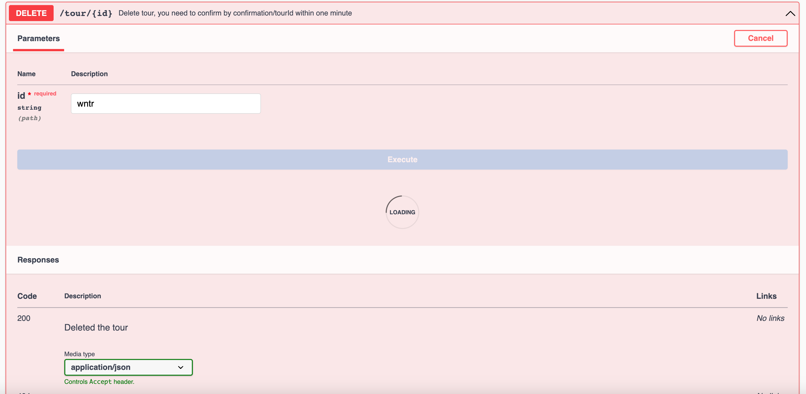
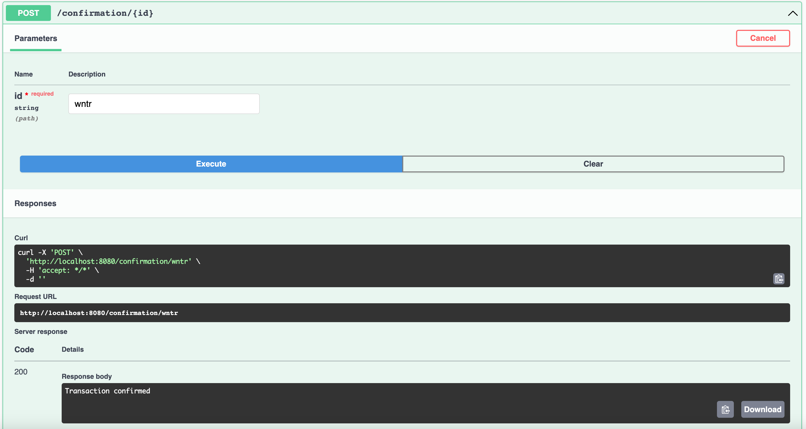
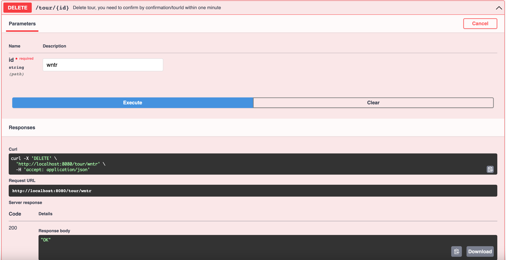
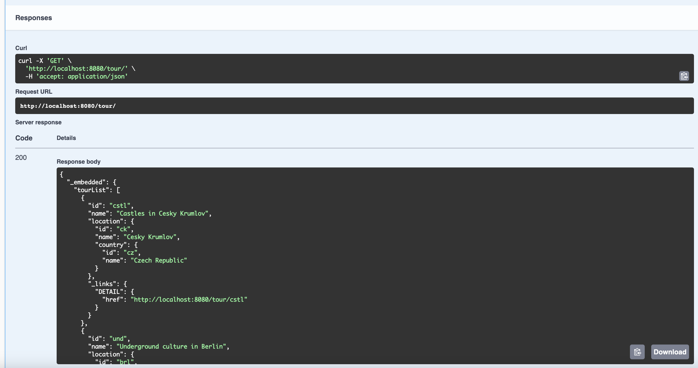

RESTfull - Asynchronous operation

We have 2 controllers: TourController and ConfirmationController

TourController has GET link /tour that gives all tours:

1. For example, we can delete tour with id "wntr" (I used non-integer id's):

2. After clicking execute, delete is waiting for confirmation. I used 1 min "Thread.sleep".
3. Within 1 minute we need to confirm this operation.
4. We use ConfirmationController for confirmation. We need to send POST request with our tour id "wntr":

5. We got "Transaction confirmed" response which means that our operation was successful.
6. We got "OK" response which means that tour was successfully deleted 

7. Now we don't have "wntr" tour:
