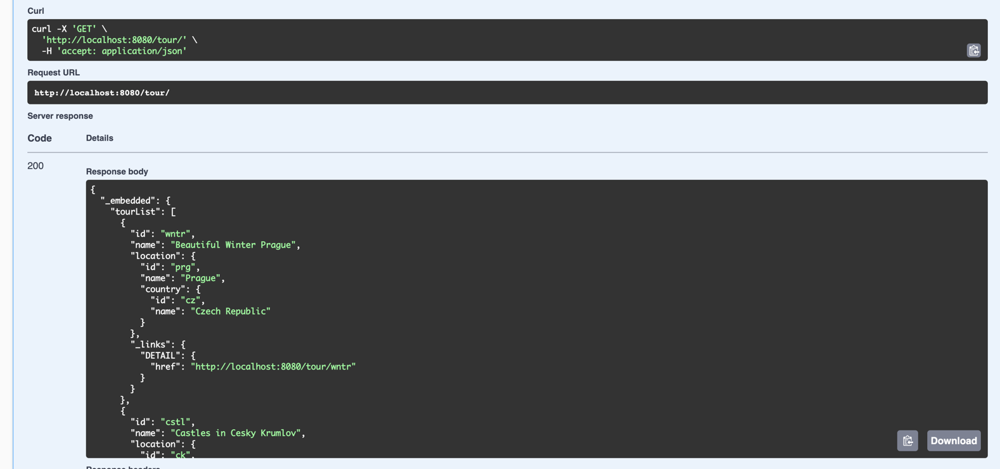
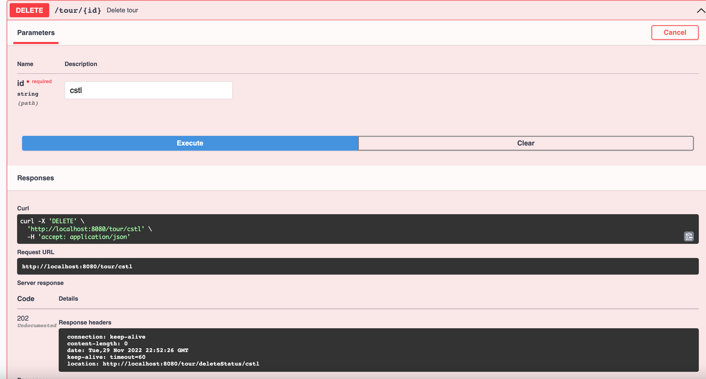
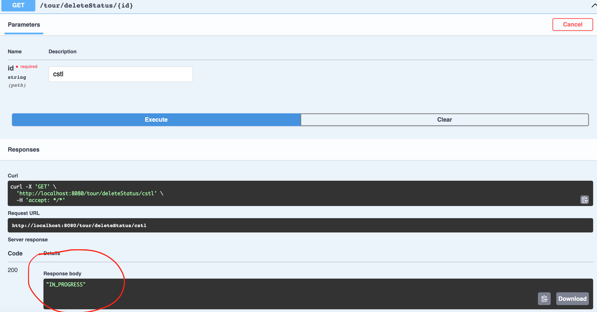
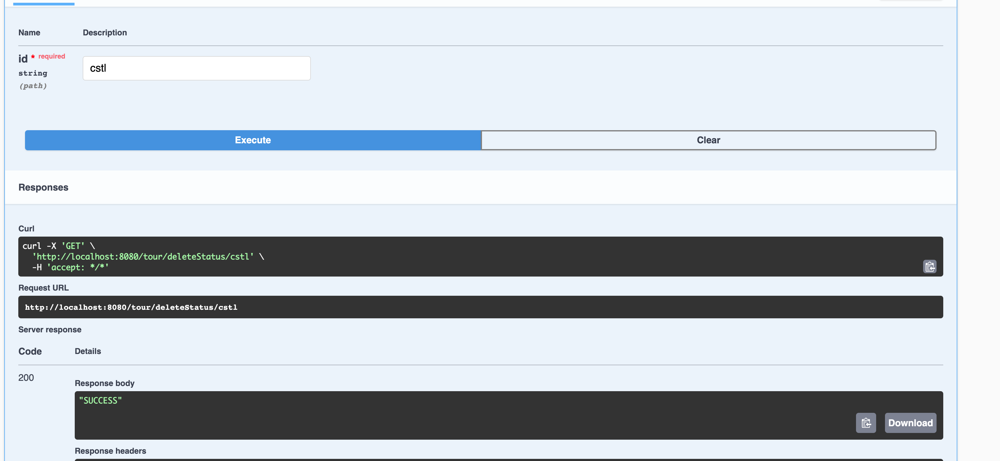

RESTfull - Asynchronous operation

We have 2 controllers: TourController and ConfirmationController

TourController has GET link /tour that gives all tours:

1. For example, we can delete tour with id "cstl" (I used non-integer id's):
2. After clicking execute, we got 202 status (Accepted) with location of status resource

3. Delete task in progress

4. After some time delete task is successfully completed
   