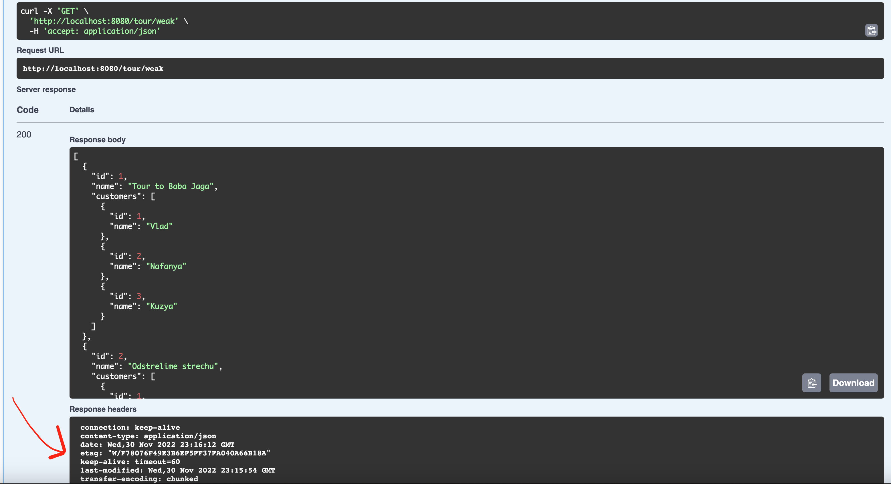
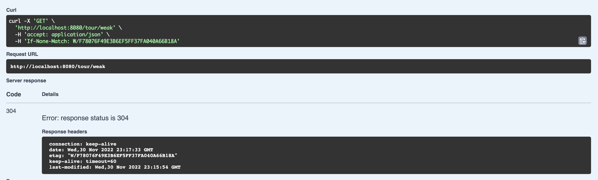
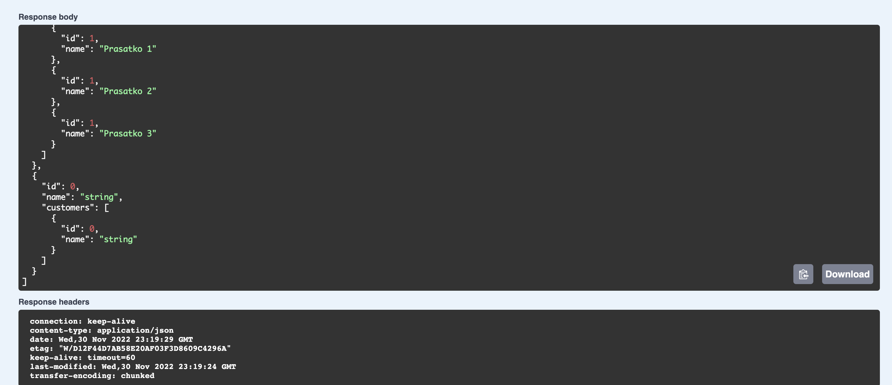

<h1>RESTfull - Conditional GET</h1>

1. Get all tours without any ETag using /tour/weak

2. Got etag: W/F78076F49E3B6EF5FF37FA040A66B18A in headers
3. Doing same request with If-None-Match header and got status 304!
   
4. After adding new element we have another etag

<h5>Same for strong eTag</h5>